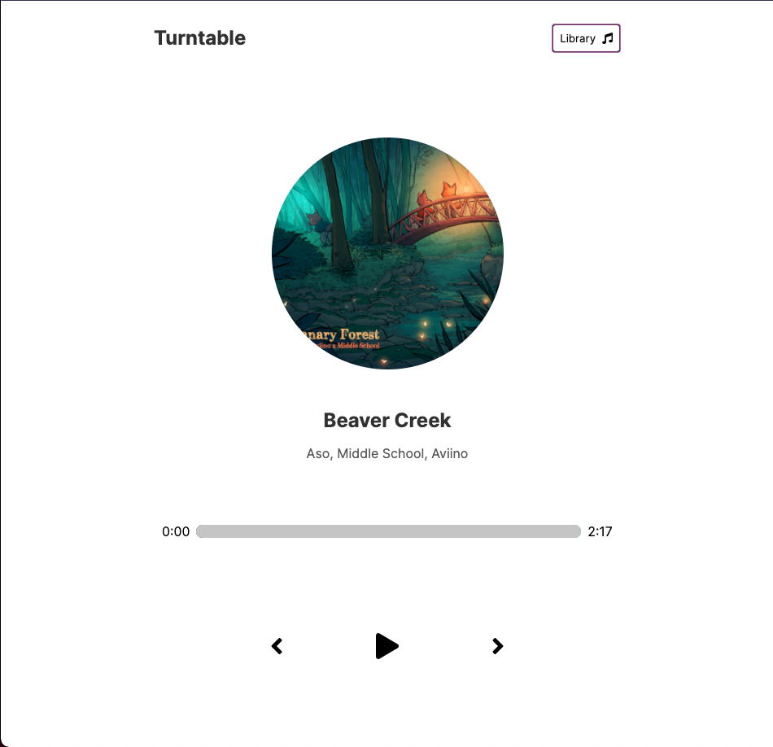
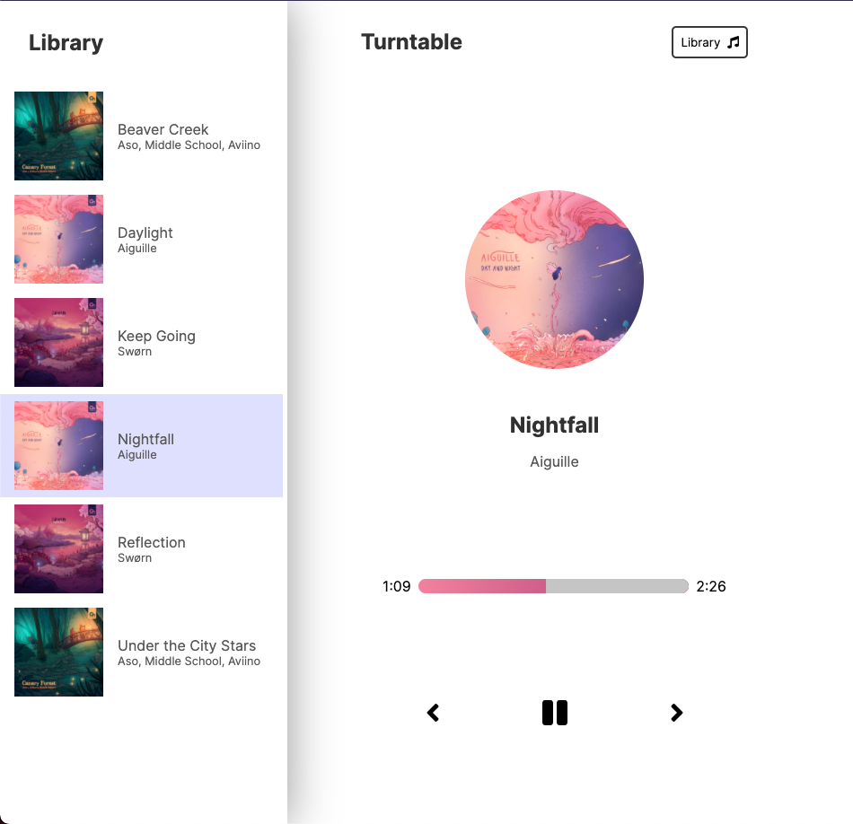

# Turntable

[Click here to launch.](https://judeclark19.github.io/turntable/)

Application with library hidden, music not playing.

Application with library showing and music playing.

This simple music player was built as an exercise in [@developedbyed](https://github.com/developedbyed)'s react course.

